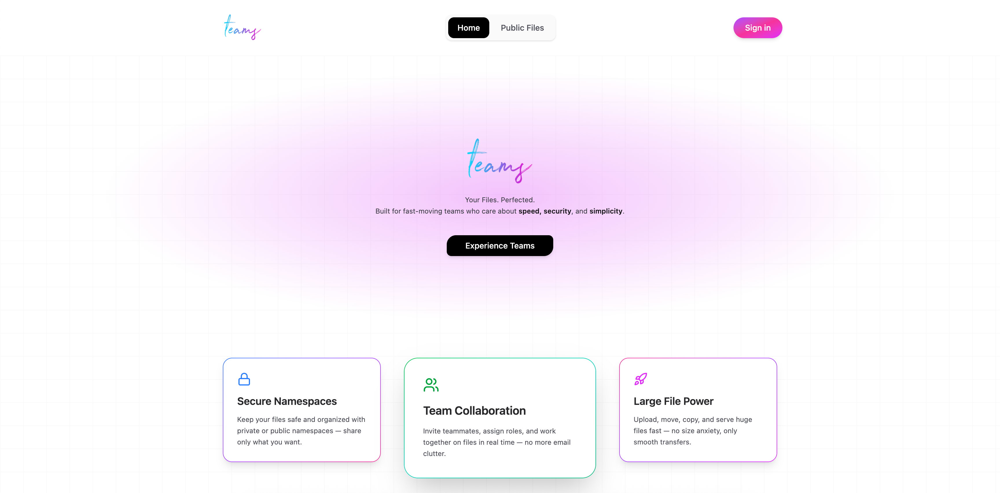

# Teams



Modern team workspace for file sharing, collaboration, and chat — built with SvelteKit, Auth.js, Drizzle ORM, and the Trelae Files SDK.

## Overview

Think of Teams as a tidy online “office” for your group:

- Sign in with Google and you’re inside your team’s space.
- Upload files (documents, videos, images) and keep them organized in folders.
- Choose who can see each file:
- Private: only you
- Team: everyone in your team
- Public: shareable with people outside the team (using a team ID + password)
- Plans have storage limits (like phone storage). If you need more space, move to a bigger plan.
- Big files (like long videos) still upload smoothly
- Chat in real time with your teammates right inside the app (no switching apps).
- Invites & roles:
  - Admin can invite people and manage seats.
  - Members can upload, view, and collaborate.
  - Email sharing makes it easy to send links to public files to clients or partners.
- Security: your files live in separate “lockers” (namespaces) for you, your team, and public sharing.

## A normal day with Teams

1. Log in with Google.
2. Click My Files to add your personal items, or Team Files to share with the team.
3. Choose visibility (Private / Team / Public) when uploading.
4. Share a Public File link with a password if you want clients to access it.
5. Chat with teammates in Chat to coordinate quickly.

> Just sign in and use it like a simple, organized shared drive with chat. [try teams](https://trelae-teams.vercel.app/)

## Description

Teams is a full‑stack SvelteKit application that provides:

- Google sign‑in and session management via Auth.js
- Team creation and seat‑limited plans (free/basic/pro/enterprise)
- Invitations and role management (admin/member)
- File storage using Trelae Files with three visibility levels: private, team, public
- Presigned uploads, including multipart for large files, with per‑plan storage limits
- Public‑files access (team‑wide share via Team ID + password) and email sharing
- Real‑time team chat using Socket.IO (separate Node process)
- A clean dashboard UI with My Files, Team Files, Public Files, and Chat

## Explanation

The app integrates Trelae Files to manage storage across distinct namespaces:

- Private namespace: created per user at first sign‑in
- Team namespace: created when a user purchases/creates a team plan
- Public namespace: created along with team namespace for public sharing

Uploads go directly from the browser to Trelae using presigned URLs. Files are tracked in Postgres via Drizzle ORM with metadata such as size, location, visibility, and status. Storage usage is computed from the database and enforced against the plan limits. The Socket.IO server runs alongside the SvelteKit app to power real‑time chat and events.

## Packages

### Core

- `svelte`, `@sveltejs/kit`, `vite`: SvelteKit app runtime and tooling
- `@sveltejs/adapter-auto`, `@sveltejs/adapter-vercel`: build adapters

### UI

- `@lucide/svelte`, `lucide-svelte`: icons
- `bits-ui`, `svelte-sonner`: UI primitives and toasts
- `tailwindcss`, `@tailwindcss/vite`, `tailwind-merge`, `tailwind-variants`, `tw-animate-css`: styling

### Auth

- `@auth/core`, `@auth/sveltekit`: authentication (Google OAuth)

### Database

- `drizzle-orm`, `drizzle-kit`: ORM and migration tooling
- `pg`, `@neondatabase/serverless`: Postgres client and Neon support

### Storage

- `trelae-files`: Trelae Files SDK

### Realtime

- `socket.io`, `socket.io-client`: web socket server and client

### Email

- `resend`: transactional emails for invites and public access

### Server/Tooling

- `express`: lightweight server for the Socket.IO process
- `tsx`, `typescript`: TypeScript tooling and runners
- `concurrently`: run SvelteKit and Socket server in dev
- `eslint`, `prettier`, `svelte-check`: linting and type checks

## Usage

Prerequisites

- Node.js 18+ and `pnpm` installed
- A Postgres database (Neon recommended)
- Google OAuth credentials
- Resend API key (for email)
- Trelae API key

### Clone and install

```bash
pnpm install
```

### Configure environment

Create `.env` based on `.env.example`:

```bash
DATABASE_URL=postgresql://...            # Postgres connection
GOOGLE_CLIENT_ID=...                     # Google OAuth client id
GOOGLE_CLIENT_SECRET=...                 # Google OAuth secret
AUTH_SECRET=...                          # Any long random string
AUTH_ORIGIN=http://localhost:5173        # Auth.js origin for local dev
AUTH_TRUST_HOST=true                     # Allow Auth.js to trust dev host
RESEND_API_KEY=...                       # Resend API key for email invites
PUBLIC_SITE_URL=http://localhost:5173    # Public URL used in emails
TRELAE_API_KEY=...                       # Trelae Files SDK API key
PUBLIC_SOCKET_PORT=3001                  # Local Socket.IO server port
SOCKET_SERVER_URL=http://localhost:3001  # Internal server URL used by app
PUBLIC_SOCKET_URL=http://localhost:3001  # Public URL used by client
```

### Initialize database (Drizzle)

```bash
pnpm db:push     # push schema
# or
pnpm db:migrate  # run generated migrations (if any)
pnpm db:studio   # optional: explore DB in Drizzle Studio
```

### Start in development

```bash
pnpm dev
```

This runs SvelteKit and the Socket.IO server concurrently. Visit `http://localhost:5173`.

### Build and preview

```bash
pnpm build
pnpm preview
```

### Notes

- The app uses Google sign‑in; ensure the OAuth consent screen and redirect URIs point to your site (or localhost in dev).
- For production deploys, choose and configure a SvelteKit adapter (Vercel adapter is included).

## App Structure

### Top‑level

- `src/`: SvelteKit routes, lib, and app assets
- `src/lib/server/db/`: Drizzle schema and DB setup
- `src/lib/trelae.ts`: Trelae Files SDK client
- `src/socket-server.ts`: Socket.IO + Express server for real‑time chat
- `static/`: static assets
- `drizzle.config.ts`, `vite.config.ts`, `svelte.config.js`: project config
- `.env.example`: sample environment variables

### Routes

- `src/routes/+page.svelte`: landing/login flow
- `src/routes/dashboard/+page.svelte`: main dashboard (usage, members, invites)
- `src/routes/dashboard/my-files/…`: personal files views
- `src/routes/dashboard/files-team/…`: team files views
- `src/routes/public-files/…`: public files unlock + listing
- `src/routes/dashboard/chat/…`: team chat UI and server actions

### API

- `src/routes/api/upload/+server.ts`: presigned uploads (single + multipart)
- `src/routes/api/files/+server.ts`: list/delete files (by namespace/visibility)
- `src/routes/api/folder/+server.ts`: create folders
- `src/routes/api/limits/+server.ts`: per‑plan storage usage and limits
- `src/routes/api/plan/+server.ts`: delete team plan (tears down namespaces/files)
- `src/routes/api/team/+server.ts`: set/get public‑files password (admin)
- `src/routes/api/team/leave/+server.ts`: member leaves team
- `src/routes/api/invite/+server.ts`: invite/delete invites (+ seat enforcement)
- `src/routes/api/public-share/+server.ts`: email Team ID + public password
- `src/lib/socket/+server.ts`: bridge for broadcasting chat to Socket.IO

## Scripts

### Common scripts

- `pnpm dev`: run SvelteKit dev server and Socket server concurrently
- `pnpm build`: build for production
- `pnpm preview`: preview the production build locally
- `pnpm check`, `pnpm check:watch`: Svelte type checks
- `pnpm lint`, `pnpm format`: formatting and linting
- `pnpm db:push`, `pnpm db:migrate`, `pnpm db:studio`: Drizzle database tasks

## Social Links

- [Trelae](https://trelae.com/)
- [GitHub](https://github.com/SHVM-09/trelae-teams)
- [Blog](https://trelae.com/blog)
